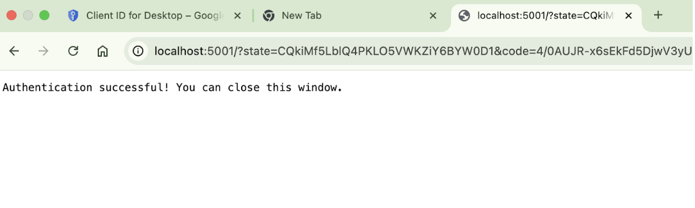
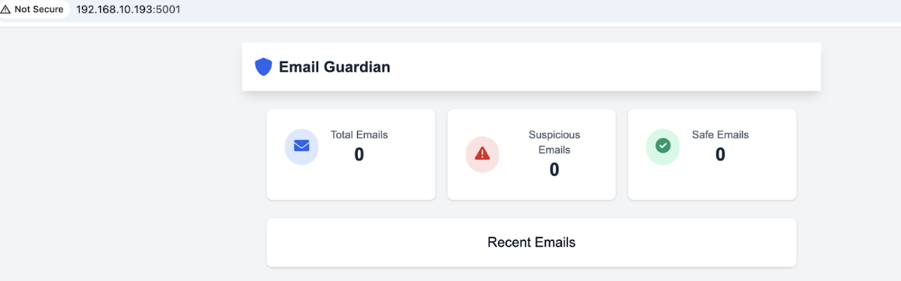
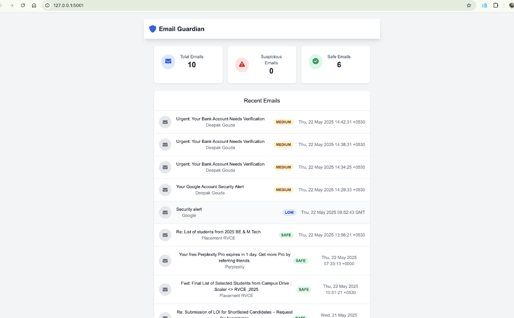

# Email Guardian AI 🛡️

A powerful AI-driven email security tool that protects your Gmail inbox from phishing, spam, and malicious content using GPT-4.

---

## Overview

Email Guardian is an intelligent email security solution that analyzes your Gmail messages in real-time to identify potential security threats. Using advanced AI (GPT-4) and comprehensive security checks, it provides detailed risk analysis and actionable recommendations to keep your inbox safe.

---

## Tech Stack

- **Backend**: Python 3.8+, Flask  
- **Frontend**: HTML, CSS, JavaScript  
- **Database**: MongoDB  
- **Authentication**: Google OAuth2  
- **AI/ML**: OpenAI GPT-4  
- **APIs**: Gmail API, OpenAI API  
- **Security**: SPF, DMARC, DKIM validation  

---

## Screenshots

### ✅ Successful Authentication

After authenticating with your Gmail account via Google OAuth2, you will see this confirmation screen:



---

### 🖥️ Dashboard Preview

#### 📥 Initial Empty State

When you first log in, the dashboard will appear empty, awaiting email analysis:



#### 🛡️ Populated Dashboard with Risk Categorization

After analysis, emails are categorized into different risk levels:



---

## Features

- 🔍 **AI-Powered Analysis**: Uses GPT-4 to detect phishing and malicious content  
- 🎯 **Risk Scoring**: Categorizes emails into five risk levels (SAFE, LOW, MEDIUM, HIGH, CRITICAL)  
- 🔐 **Security Checks**:
  - SPF, DMARC, and DKIM validation  
  - Suspicious URL detection  
  - Sender authentication  
  - Display name spoofing detection  
- 📊 **Detailed Analysis**: Offers security reports with actionable recommendations  
- 🔄 **Real-time Monitoring**: Monitors your inbox for new threats  
- 📱 **User-friendly Interface**: Intuitive web interface for reviewing analysis  

---

## How to Run

1. **Clone the repository**
   ```bash
   git clone https://github.com/deepakgoudasirsi/email-guardian-ai.git
   cd email-guardian-ai

---

## Contact
Deepak Gouda - [@deepakgoudasirsi](https://github.com/deepakgoudasirsi)
Project Link: [https://github.com/deepakgoudasirsi/email-guardian-ai](https://github.com/deepakgoudasirsi/email-guardian-ai)
